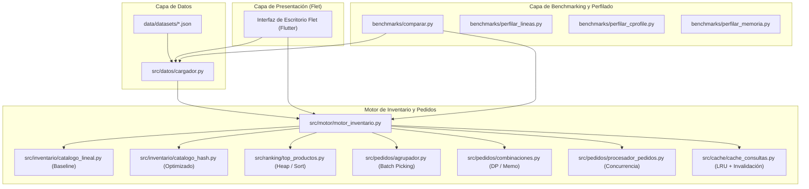

# Optimizador de Inventario y Pedidos

**Primer Parcial – Programación Eficiente (Opción 6)**  
*Universidad Blas Pascal (UBP)*  
**Lenguaje:** Python 3  
**Interfaz de usuario:** Flet (Flutter para Python)  

> [!TIP]
> **Recursos Clave para la Defensa Oral:**
> - 🖥️ **Presentación Interactiva (HTML + JSON + CSS):** [docs/presentation/index.html](docs/presentation/index.html)
> - 📖 **Guía Canónica de Flujo de la Aplicación:** [docs/app-flow-explanation.md](docs/app-flow-explanation.md)
> - 📊 **Enunciado y Rúbrica Oficial de Cátedra:** [docs/option-six-to-be-implemented.txt](docs/option-six-to-be-implemented.txt)

---

## 1. Descripción del problema y objetivos

En los centros de distribución y almacenes logísticos modernos, la gestión ágil del inventario y la preparación oportuna de pedidos (*order picking*) son factores determinantes para la competitividad operativa. A medida que el catálogo crece a miles de productos y se reciben lotes masivos de pedidos concurrentes, las implementaciones ingenuas basadas en búsquedas lineales, ordenamientos completos y procesamiento secuencial colapsan rápidamente por saturación de CPU y degradación temporal.

Este proyecto tiene como propósito resolver este problema mediante el diseño y desarrollo de un **Optimizador de Inventario y Pedidos** de alto rendimiento en Python. 

### Objetivo académico
El sistema no es un simple sistema CRUD, sino una plataforma experimental destinada a demostrar, medir y justificar empírica y analíticamente técnicas avanzadas de programación eficiente:
- **Análisis riguroso de complejidad algorítmica** ($O$).
- **Selección de estructuras de datos idóneas** para optimizar el acceso y agregación.
- **Elección algorítmica justificada** (p. ej. heaps vs. ordenamiento completo, programación dinámica vs. búsqueda exhaustiva).
- **Estrategias de reutilización de cómputo**: diferenciación conceptual e implementación de **memoización** y **caching inteligente** con invalidación reactiva.
- **Concurrencia y paralelismo real** mediante procesos independientes para superar el Global Interpreter Lock (GIL) de Python en tareas CPU-bound.
- **Perfilado sistemático** con diversas herramientas de la industria (`cProfile`, `line_profiler`, `memory_profiler`, `tracemalloc`, `Scalene`, `py-spy`).
- **Demostración experimental** mediante la convivencia y comparación directa de una versión inicial (*baseline*) contra la versión optimizada sobre idénticos conjuntos de datos.

---

## 2. Desafío experimental central

La rúbrica de la cátedra exige demostrar experimentalmente la brecha de rendimiento entre una estructura inadecuada y una adecuada. 

El núcleo del desafío enfrenta:
1. **Catálogo Lineal (Inadecuado):** Almacenamiento en lista contigua con búsqueda secuencial $O(n)$. Al preparar pedidos de múltiples líneas sobre catálogos extensos, la complejidad temporal escala a $O(m \cdot n)$ (donde $m$ es la cantidad de ítems solicitados y $n$ la cantidad de productos del catálogo).
2. **Catálogo Hash (Adecuado):** Almacenamiento indexado en tabla hash (`dict`) con resolución de colisiones y búsqueda en tiempo promedio constante $O(1)$, reduciendo la preparación del pedido a $O(m)$.
3. **Ranking Top-N:** Comparación entre ordenar todo el arreglo de frecuencias acumuladas $O(n \log n)$ frente al uso de un heap acotado $O(n \log k)$ con $k \ll n$.
4. **Cálculo de alternativas:** Comparación entre árbol de exploración recursivo exponencial $O(2^n)$ frente a Programación Dinámica memoizada $O(n \cdot P)$ (donde $P$ es el presupuesto/restricción).
5. **Lotes de pedidos:** Ejecución secuencial mono-hilo frente a procesamiento paralelo distribuido con `ProcessPoolExecutor`.

---

## 3. Alcance funcional y cobertura de la rúbrica

Cada requerimiento del sistema responde directamente a un criterio de evaluación establecido en la rúbrica del parcial:

| Funcionalidad | Operación crítica | Requisito de la rúbrica | Técnica / Estructura aplicada | Justificación técnica |
|---|---|---|---|---|
| **Catálogo y búsqueda rápida** | Búsqueda por identificador y por nombre | 1. Baseline<br>2. Complejidad<br>4. Estructuras | Lista vs. Diccionario (`dict`) | Búsqueda secuencial $O(n)$ en lista frente a búsqueda por clave hash en $O(1)$ promedio. |
| **Agrupación de pedidos (*Batch Picking*)** | Fusión y consolidación de líneas de demanda | 2. Complejidad<br>4. Estructuras | Tabla de acumulación (`dict`) | Agrupación en una sola pasada $O(L)$ sobre el total de líneas, evitando recorridos cuadráticos anidados. |
| **Productos más solicitados** | Selección de los $k$ ítems con mayor frecuencia | 3. Elección de algoritmos<br>4. Estructuras | Ordenamiento completo vs. Min/Max Heap (`heapq`) | `heapq.nlargest` opera en $O(n \log k)$, superando a un `sort` integral de $O(n \log n)$ cuando $k \ll n$. |
| **Alternativas para completar pedidos** | Búsqueda de combinaciones sustitutas por categoría y presupuesto | 3. Algoritmos<br>5. Memoización | Búsqueda exhaustiva vs. DP memoizada (`@lru_cache` / tabla DP) | Se eliminan ramas recomputadas de subproblemas idénticos, podando la explosión combinatoria. |
| **Consultas frecuentes** | Búsqueda de catálogo y ranking reiterado | 5. Caching inteligente con invalidación | Caché LRU en memoria + invalidación reactiva | Evita reejecutar consultas idénticas. Se invalida explícitamente ante mutaciones de stock o registro de pedidos para evitar datos obsoletos. |
| **Procesamiento masivo de pedidos** | Validación de disponibilidad y asignación de stock por lote | 6. Concurrencia y paralelismo | Secuencial vs. `ProcessPoolExecutor` | Tareas CPU-bound independientes. Se usa paralelismo por procesos para sortear el GIL de Python, analizando el overhead de IPC. |
| **Perfilado y métricas** | Diagnóstico de cuellos de botella y memoria | 7. Perfilado y medición | Suite multi-herramienta + tabla comparativa | Mediciones antes/después con herramientas complementarias (CPU, líneas, memoria, muestreo externo). |

---

## 4. Estructuras de datos utilizadas

En cumplimiento con el requisito de justificar formalmente al menos dos (y en este caso cuatro) estructuras de datos:

1. **`list` (Lista dinámica):**
   - *Rol:* Utilizada como línea base (*baseline*) para representar el catálogo y para preservar el orden cronológico estricto de recepción de pedidos.
   - *Operaciones:* Inserción al final $O(1)$ amortizado, recorrido secuencial $O(n)$.
2. **`dict` (Tabla hash asociativa):**
   - *Rol:* Estructura primaria del catálogo optimizado (clave: `id_producto`, valor: instancia de `Producto`) e índice secundario por categoría. También utilizada para la agregación de demanda en batch picking.
   - *Operaciones:* Inserción, búsqueda y actualización en tiempo $O(1)$ promedio.
3. **`heapq` (Montículo binario / Priority Queue):**
   - *Rol:* Obtención eficiente de los $k$ productos más solicitados a partir del mapa de frecuencias acumuladas.
   - *Operaciones:* Mantiene un montículo de tamaño máximo $k$, permitiendo inserciones y reemplazos en $O(\log k)$.
4. **`set` (Conjunto hash):**
   - *Rol:* Validación instantánea de existencia de productos y control de unicidad de identificadores al importar o procesar lotes de pedidos.
   - *Operaciones:* Pertenencia (`item in set`) en $O(1)$ promedio.

---

## 5. Diferenciación: Memoización vs. Caching inteligente

Para asegurar el rigor conceptual exigido en la presentación oral y en el informe:

- **Memoización (Nivel Algorítmico):**
  - *Ámbito:* Función de cálculo de combinaciones de productos sustitutos (`combinaciones.py`).
  - *Qué almacena:* Tuplas con el estado del subproblema `(indice_producto, presupuesto_restante)`.
  - *Cuándo se reutiliza:* Cuando distintas ramas del árbol recursivo convergen a la misma cota presupuestaria y categoría.
  - *Invalidación:* El caché local de la función se reinicia si cambia la lista subyacente de productos elegibles de la categoría.
- **Caching Inteligente (Nivel Sistema):**
  - *Ámbito:* Fachada de consultas del inventario (`cache_consultas.py`).
  - *Qué almacena:* Resultados completos de búsquedas por texto y el ranking de productos más solicitados.
  - *Estrategia de desalojo:* Capacidad acotada mediante política Least Recently Used (LRU).
  - *Estrategia de invalidación:* **Invalidación reactiva**. Toda operación de escritura (alta de producto, modificación de inventario o procesamiento de pedidos) dispara la purga inmediata de las entradas asociadas para garantizar coherencia estricta de datos.

---

## 6. Arquitectura del software

El sistema sigue un diseño desacoplado donde la lógica de negocio y los algoritmos son independientes de la interfaz gráfica y de las herramientas de medición:



### Principio de diseño fundamental
Tanto la aplicación de escritorio Flet como los scripts de medición consumen **exactamente la misma API del motor**, permitiendo alternar estrategias (`estrategia="baseline"` vs. `estrategia="optimizado"`, `concurrencia=False` vs. `concurrencia=True`) con garantía de reproducibilidad.

---

## 7. Datasets de prueba versionados

Para garantizar mediciones consistentes y reproducibles, se definen datasets JSON sintéticos y curados en `data/datasets/`:

| Archivo | Cantidad de productos | Cantidad de pedidos | Propósito principal |
|---|---|---|---|
| `demo_oral.json` | ~30 productos | ~8 pedidos | Escenario curado para la exposición oral en vivo. Nombres legibles, faltantes deliberados para activar alternativas y combinaciones. |
| `pequeno.json` | 100 productos | 20 pedidos | Pruebas unitarias automatizadas y verificación rápida de la interfaz. |
| `mediano.json` | 1.000 productos | 200 pedidos | Escenario donde la brecha temporal entre lista y hash se hace evidente ($>10\times$). |
| `grande.json` | 10.000 productos | 2.000 pedidos | Prueba de escalabilidad y evaluación de concurrencia multiproceso frente a overhead. |
| `masivo.json` | 100.000 productos | 10.000 pedidos | Escenario de estrés extremo para benchmarks y análisis de memoria (generado bajo demanda). |

Todos los datasets sintéticos se producen de manera determinista mediante `benchmarks/generar_datos.py` con una semilla pseudoaleatoria fija (`semilla=42`).

---

## 8. Suite de medición y herramientas de perfilado

En estricta conformidad con el requisito 7 de la rúbrica, se utilizan de forma complementaria las herramientas de diagnóstico recomendadas:

| Herramienta | Tipo de análisis | Pregunta que responde |
|---|---|---|
| **`time.perf_counter` / `timeit`** | Medición de pared de alta precisión | ¿Cuánto tiempo real tarda una corrida en condiciones idénticas de entrada? Alimenta la tabla comparativa obligatoria. |
| **`cProfile` + `pstats`** | Instrumentación determinista por función | ¿Cuál es la función o método que acumula el mayor porcentaje del tiempo total de cómputo? Identifica el cuello de botella general. |
| **`line_profiler` (`kernprof`)** | Instrumentación línea a línea | ¿Qué línea de código específica dentro de la función crítica es la causante del retraso (ej. el bucle `for` en catálogo lineal vs. acceso a hash)? |
| **`tracemalloc` / `memory_profiler`** | Monitoreo del uso de memoria heap | ¿Cuál es el trade-off espacial del índice hash, la memoria del heap y la caché LRU frente al catálogo lineal? |
| **`Scalene`** | Perfilador cuádruple (CPU / Memoria / Python vs. C) | ¿El tiempo consumido se debe a sobrecarga del intérprete de Python o al costo intrínseco del algoritmo implementado? |
| **`py-spy`** | Muestreo estadístico de baja intrusión | ¿Cómo se comportan los procesos hijos de `ProcessPoolExecutor` sin distorsionar los tiempos de ejecución con instrumentación invasiva? |

### Tabla comparativa obligatoria de la rúbrica
Los scripts de benchmarking (`benchmarks/comparar.py`) completan automáticamente la tabla estandarizada exigida por la cátedra:

| Versión | Tiempo (ms) | Memoria (MB) | Observación / Justificación |
|---|---|---|---|
| **Implementación inicial (Baseline)** | *Medido* | *Medido* | Catálogo en lista $O(n)$, ordenamiento total para top-N, procesamiento secuencial mono-hilo. |
| **Estructura optimizada** | *Medido* | *Medido* | Reemplazo de lista por `dict` $O(1)$. Impacto directo en la preparación de pedidos. |
| **Algoritmo optimizado** | *Medido* | *Medido* | Min-heap (`heapq`) para top-N y DP memoizada para cálculo de alternativas. |
| **Concurrencia / Paralelismo** | *Medido* | *Medido* | `ProcessPoolExecutor` para procesamiento paralelo de lotes independientes. Evaluación de overhead. |
| **Versión final integrada** | *Medido* | *Medido* | Catálogo hash + Heaps + Memoización + Caché LRU reactiva + Multiproceso optimizado. |

---

## 9. Estructura del repositorio

```text
PEF-Parcial-I-Optimizador-de-Inventario/
├── README.md                           # Documento de alcance general (este archivo)
├── requirements.txt                    # Dependencias de producción y UI (flet)
├── requirements-dev.txt                # Dependencias de profiling y pruebas
├── data/
│   └── datasets/                       # Escenarios de prueba JSON versionados
│       ├── demo_oral.json
│       ├── pequeno.json
│       ├── mediano.json
│       └── grande.json
├── docs/
│   ├── project-planning.md             # Plan canónico de desarrollo por etapas
│   ├── option-six-to-be-implemented.txt # Enunciado y rúbrica oficial de la cátedra
│   ├── app-flow-explanation.md         # Guía integral del flujo de la app y funciones backend
│   ├── analisis.md                     # Derivación de complejidad (grupo + bloque Origin)
│   ├── propuestas-mejora.md            # Informe de hotspots (Automatización 2)
│   ├── automatizaciones-origin.md      # Cómo activar los triggers en Cursor
│   ├── prompts-origin/                 # Prompts listos para el dashboard
│   ├── mediciones/                     # Salidas crudas y perfiles (.prof, .txt, capturas)
│   └── presentation/                   # Presentación interactiva para la defensa oral
│       ├── index.html                  # Escenario y reproductor web de diapositivas
│       ├── slides.json                 # Contenido estructurado de las 11 diapositivas
│       ├── styles.css                  # Tema Obsidian Slate & Electric Sky
│       └── app.js                      # Lógica interactiva, timer, atajos y notas
├── automations/                        # Núcleo reproducible de las automations Origin
│   ├── ejecutar.py                     # CLI: python -m automations.ejecutar
│   ├── analizar_complejidad.py         # AST → bloque marcado en analisis.md
│   └── proponer_mejoras.py             # mediciones/ → propuestas-mejora.md
├── src/
│   ├── __init__.py
│   ├── modelos/                        # Modelos de dominio (Producto, LineaPedido, Pedido)
│   ├── inventario/                     # Catálogo lineal (baseline) y catálogo hash
│   ├── pedidos/                        # Agrupador, combinaciones (DP) y procesadores
│   ├── ranking/                        # Algoritmos top-N (sort vs. heapq)
│   ├── cache/                          # Caché LRU de consultas con invalidación
│   ├── datos/                          # Cargador y validador de datasets JSON
│   ├── motor/                          # Fachada unificada del motor de inventario
│   └── ui/                             # Aplicación de escritorio en Flet
│       ├── componentes/                # Tarjetas, tablas de métricas, controles accesibles
│       └── pantallas/                  # Vistas: catálogo, pedidos, agrupación, top-N, métricas
├── benchmarks/
│   ├── generar_datos.py                # Generador determinista de datos sintéticos
│   ├── comparar.py                     # Ejecutor de la tabla comparativa oficial
│   ├── perfilar_cprofile.py            # Script de perfilado con cProfile
│   ├── perfilar_lineas.py              # Script de perfilado con line_profiler
│   └── perfilar_memoria.py             # Script de perfilado con memory_profiler / tracemalloc
└── tests/                              # Pruebas automatizadas de equivalencia y corrección
```

---

## 10. Instalación y ejecución

### Requisitos previos
- **Python 3.10** o superior instalado en el sistema operativo.
- Entorno de terminal (PowerShell, Bash o Zsh).

### 1. Clonar el repositorio y configurar el entorno virtual
```bash
git clone https://github.com/GastMolina267/PEF-Parcial-I-Optimizador-de-Inventario.git
cd PEF-Parcial-I-Optimizador-de-Inventario

# Crear el entorno virtual
python -m venv .venv

# Activar el entorno virtual
# En Windows (PowerShell):
.venv\Scripts\Activate.ps1
# En Linux / macOS:
source .venv/bin/activate
```

### 2. Instalar dependencias
```bash
# Dependencias base de la aplicación y Flet
pip install -r requirements.txt

# Dependencias de perfilado y desarrollo
pip install -r requirements-dev.txt
```

### 3. Ejecutar la aplicación de escritorio (Flet)
```bash
python -m src.ui.app
```

### 4. Ejecutar la suite de comparación y mediciones
```bash
# Tabla comparativa completa de la rúbrica (tiempo y memoria)
python -m benchmarks.comparar

# Perfilado por funciones (cProfile)
python -m benchmarks.perfilar_cprofile

# Perfilado línea a línea (line_profiler)
python -m benchmarks.perfilar_lineas

# Perfilado de consumo de memoria
python -m benchmarks.perfilar_memoria

# Automatizaciones Origin (complejidad + propuestas, sin tocar el motor)
python -m automations.ejecutar
```

### 5. Ejecutar pruebas automatizadas
```bash
pytest tests/ -v
```

### 6. Abrir la presentación interactiva (HTML + JSON + CSS)
La defensa oral cuenta con una suite interactiva de diapositivas en `docs/presentation/`:
```bash
# Opción A: Abrir directamente en el navegador predeterminado
start docs/presentation/index.html   # En Windows
open docs/presentation/index.html    # En macOS

# Opción B: Servir localmente con Python
python -m http.server 8000 -d docs/presentation
# Luego ingresar en el navegador a: http://localhost:8000
```

---

## 11. Presentación oral interactiva (Estructura de 10 a 15 minutos)

El proyecto incluye una **plataforma web interactiva de presentación** en [docs/presentation/](docs/presentation/), diseñada en estricta conformidad con la propuesta de PowerPoint de la cátedra detallada en [docs/option-six-to-be-implemented.txt](docs/option-six-to-be-implemented.txt):

- **Atajos de Teclado para la Exposición:**
  - `→` / `Espacio` / `AvPág`: Siguiente diapositiva.
  - `←` / `RePág`: Diapositiva anterior.
  - `F`: Alternar modo pantalla completa.
  - `N`: Abrir/cerrar el **modal de notas para el orador** con la guía discursiva de cada punto.
  - `T`: Iniciar / pausar el cronómetro de 15 minutos integrado.

### Contenido de las 11 Diapositivas Estructuradas:
1. **El Problema:** Logística de almacenes, cuello de botella en preparación de pedidos masivos sobre catálogos crecientes (hasta 10.000 productos).
2. **Diseño Inicial vs. Optimizado:** Arquitectura general y convivencia de la línea base (*baseline*) contra la versión optimizada bajo la fachada unificada `MotorInventario`.
3. **Complejidad Algorítmica:** Derivación formal analítica y matemática de las operaciones críticas ($O(n) \to O(1)$, $O(P \cdot L \cdot n) \to O(P \cdot L)$, $O(2^N) \to O(N \cdot P)$).
4. **Algoritmos y Estructuras:** Justificación rigurosa de las 4 estructuras centrales: `list`, `dict`, `heapq` y `set`.
5. **Memoización vs. Caching:** Diferenciación conceptual estricta requerida por la rúbrica (memoización interna en DP vs. caching LRU a nivel sistema con invalidación reactiva).
6. **Concurrencia y Paralelismo:** Análisis del uso de `ProcessPoolExecutor`, evasión del GIL de CPython, y discusión técnica de la **Ley de Amdahl** y el costo de IPC en Windows.
7. **Perfilado Sistemático:** Diagnóstico multi-herramienta con `cProfile`, `line_profiler`, `tracemalloc`, `Scalene` y `py-spy`.
8. **Comparación de Resultados (Tabla Oficial):** Tabla obligatoria estandarizada de Tiempo (ms), Memoria (MB), Speedup y Observación.
9. **Demostración de la Aplicación:** Recorrido por las 7 vistas de la UI en Flet (`Inicio`, `Catálogo`, `Pedidos` con auditoría desplegable, `Batch Picking`, `Top-N`, `Alternativas DP` y `Desafío Experimental`).
10. **Conclusiones y Autocrítica:** Evaluación de qué optimización produjo mayor impacto (DP y Hash $O(1)$) y autocrítica sobre cuándo la concurrencia no es ventajosa.
11. **Flujo Detallado de Funciones:** Vinculación directa con la [Guía Canónica de Flujo de la Aplicación](docs/app-flow-explanation.md).

---

## 12. Automatizaciones Origin (En cada push)

Dos agentes en la nube de **Cursor Origin** (no GitHub Actions) se disparan ante un `push` o una PR. El núcleo es reproducible en local; el dashboard solo programa el trigger. Guía de activación: [docs/automatizaciones-origin.md](docs/automatizaciones-origin.md).

1. **Automatización de Complejidad Temporal:**  
   Recorre el AST de las funciones fundamentales del motor (`catalogo_hash`, `catalogo_lineal`, `agrupador`, `top_productos`, `combinaciones`, procesadores, caché), deriva mejor/promedio/peor con evidencia del cuerpo y regenera el bloque marcado en [docs/analisis.md](docs/analisis.md). No reescribe lógica de negocio.
2. **Automatización de Hotspots y Propuestas de Mejora:**  
   Prioriza artefactos en `docs/mediciones/` (cProfile, line_profiler, memoria, tabla comparativa). Escribe [docs/propuestas-mejora.md](docs/propuestas-mejora.md) con alternativa y trade-off. **No aplica** cambios en `src/`.

```bash
# Regenerar ambos informes (lo que invocan los agentes Origin)
python -m automations.ejecutar
```

Prompts listos para pegar en [cursor.com/automations/new](https://cursor.com/automations/new): [docs/prompts-origin/](docs/prompts-origin/). Skills versionadas: `.cursor/skills/analisis-complejidad/` y `.cursor/skills/hotspots-propuestas/`.

---

## 13. Plan de implementación por etapas

El proyecto se construye de manera incremental y modular siguiendo las etapas estipuladas en [docs/project-planning.md](docs/project-planning.md):

- [x] **Etapa 1 — Alcance y documentación:** Redefinición integral del contrato del proyecto y especificación técnica en `README.md`.
- [x] **Etapa 2 — Baseline y datos:** Modelos de dominio (`Producto`, `Pedido`), catálogo lineal ingenuo y datasets JSON versionados.
- [x] **Etapa 3 — Motor optimizado:** Catálogo hash, `heapq` para top-N, programación dinámica con memoización, caché LRU reactiva y paralelismo con `ProcessPoolExecutor`.
- [x] **Etapa 4 — Interfaz gráfica Flet:** Aplicación de escritorio con arquitectura por componentes, métricas integradas y tema accesible.
- [x] **Etapa 5 — Medición, análisis y tests:** Suite de scripts de perfilado, generación de la tabla comparativa y pruebas automatizadas de equivalencia.
- [x] **Etapa 6 — Automatizaciones Origin:** Núcleo AST + lecturas de `docs/mediciones/`, skills/prompts Origin y refresco de complejidad / propuestas en cada push.
