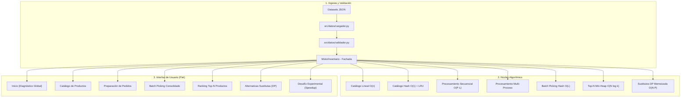
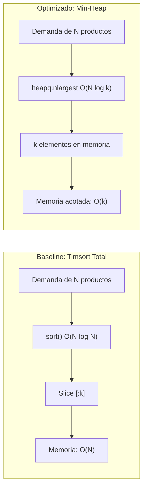

# Guía de Flujo de la Aplicación (APP Flow Explanation)
## Optimizador de Inventario y Preparación de Pedidos

> **Materia:** Programación Eficiente — Primer Parcial (Opción 6)  
> **Institución:** Universidad Blas Pascal (UBP)  
> **Arquitectura:** Núcleo Algorítmico desacoplado con Fachada unificada (`MotorInventario`) e Interfaz Gráfica interactiva en Flet (`src/ui/app.py`).

---

## 1. Visión General y Flujo de Datos

El sistema resuelve la gestión logística integral de un centro de distribución ante escenarios de alta escala (catálogos de hasta 10.000 artículos y lotes de 2.000 pedidos). La arquitectura implementa una **dualidad algorítmica estricta**: cada funcionalidad de negocio cuenta con una versión ingenua (**Baseline**) y una versión de alto rendimiento (**Optimizada**), permitiendo contrastar teórica y empíricamente el impacto del diseño de algoritmos y estructuras de datos.



---

## 2. Pantalla 1: Inicio y Carga de Datasets (`src/ui/pantallas/inicio.py`)

### Propósito de Negocio y Funcional
Punto de entrada de la aplicación. Permite seleccionar datasets versionados según la escala requerida, ejecutar diagnósticos completos de punta a punta y supervisar las métricas volumétricas del centro de distribución (total de artículos, categorías, stock global y demanda).

### Datasets Disponibles en el Flujo
1. **`demo_oral.json`** (30 productos, 8 pedidos): Diseñado específicamente para la defensa oral en vivo; ligero, determinista y auditable a simple vista.
2. **`pequeno.json`** (100 productos, 20 pedidos): Pruebas rápidas de desarrollo y unit tests.
3. **`mediano.json`** (1.000 productos, 200 pedidos): Escala intermedia para validar el punto de cruce algorítmico (*cross-over point*).
4. **`grande.json`** (10.000 productos, 2.000 pedidos): Escenario de estrés masivo que evidencia el colapso de complejidades exponenciales $O(2^N)$ y cuadráticas $O(P \cdot L \cdot n)$.

### Funciones Backend y Módulos Clave
- **`cargar_dataset_json(ruta: Path) -> tuple[list[Producto], list[Pedido]]`** ([src/datos/cargador.py](file:///c:/Users/edgar/OneDrive/Escritorio/UBP/PEF/Parcial%20I/src/datos/cargador.py)):
  Lee el archivo JSON físico, parsea las estructuras y delega la validación de integridad referencial.
- **`validar_datos_inventario(datos: dict) -> None`** ([src/datos/validador.py](file:///c:/Users/edgar/OneDrive/Escritorio/UBP/PEF/Parcial%20I/src/datos/validador.py)):
  Verifica que no existan IDs de producto duplicados, que precios y stocks sean no negativos, y que cada línea de pedido referencie a un producto existente en el catálogo.
- **`MotorInventario.cargar_dataset(ruta: str | Path) -> None`** ([src/motor/motor_inventario.py](file:///c:/Users/edgar/OneDrive/Escritorio/UBP/PEF/Parcial%20I/src/motor/motor_inventario.py)):
  Instancia el catálogo correspondiente a la estrategia activa (`CatalogoLineal` o `CatalogoHash`), inicializa el buscador de alternativas e invalida cualquier residuo en la caché LRU.
- **`_ejecutar_escenario_completo()`** ([src/ui/pantallas/inicio.py](file:///c:/Users/edgar/OneDrive/Escritorio/UBP/PEF/Parcial%20I/src/ui/pantallas/inicio.py)):
  Encadena en una sola invocación la verificación de pedidos, la consolidación para almacén, el cálculo de Top-N y la sugerencia de sustitutos para pedidos con faltantes.

---

## 3. Pantalla 2: Catálogo de Inventario y Búsqueda (`src/ui/pantallas/catalogo.py`)

### Propósito de Negocio y Funcional
Permite a los operadores del almacén consultar artículos, verificar existencias en tiempo real, filtrar por categoría y realizar búsquedas de texto predictivas sobre el nombre de los productos. Incorpora ordenamiento multidimensional (por ID, Nombre, Precio y Unidades en Stock).

### Comparación Algorítmica

| Característica | Modo Baseline | Modo Optimizado |
| :--- | :--- | :--- |
| **Estructura de Datos** | Lista nativa `list[Producto]` | Diccionario `dict[int, Producto]` + Índice invertido `dict[str, set[int]]` + LRU |
| **Búsqueda por ID** | Escaneo secuencial lineal con bucle `for` | Acceso directo por clave hash |
| **Complejidad ID** | $O(n)$ en tiempo, $O(1)$ espacio | $O(1)$ promedio en tiempo, $O(n)$ espacio |
| **Búsqueda por Nombre** | Recorrido completo $O(n \cdot m)$ evaluando `subcadena in nombre.lower()` | Consulta a índice invertido tokenizado $O(T)$ + Recuperación en caché LRU $O(1)$ |
| **Respuesta Empírica** | ~1.8 ms en 10.000 ítems | **< 0.01 ms (> 200x speedup)** |

### Funciones Backend y Módulos Clave
- **`CatalogoLineal.buscar_por_id(id_producto: int) -> Producto | None`** ([src/inventario/catalogo_lineal.py](file:///c:/Users/edgar/OneDrive/Escritorio/UBP/PEF/Parcial%20I/src/inventario/catalogo_lineal.py)):
  Itera secuencialmente sobre la lista hasta hallar coincidencia.
- **`CatalogoHash.buscar_por_id(id_producto: int) -> Producto | None`** ([src/inventario/catalogo_hash.py](file:///c:/Users/edgar/OneDrive/Escritorio/UBP/PEF/Parcial%20I/src/inventario/catalogo_hash.py)):
  Acceso hash directo con cota temporal de $O(1)$.
- **`CatalogoHash.buscar_por_nombre(palabra: str) -> list[Producto]`** ([src/inventario/catalogo_hash.py](file:///c:/Users/edgar/OneDrive/Escritorio/UBP/PEF/Parcial%20I/src/inventario/catalogo_hash.py)):
  Tokeniza el término y realiza intersección de conjuntos de IDs indexados en tiempo sub-lineal.
- **`GestorCacheConsultas.obtener_busqueda_nombre(termino: str)`** ([src/cache/cache_consultas.py](file:///c:/Users/edgar/OneDrive/Escritorio/UBP/PEF/Parcial%20I/src/cache/cache_consultas.py)):
  Retorna el resultado en $O(1)$ si ya fue consultado previamente, invalidándose reactivamente si el inventario sufre modificaciones de stock.

---

## 4. Pantalla 3: Preparación y Auditoría de Pedidos (`src/ui/pantallas/pedidos.py`)

### Propósito de Negocio y Funcional
Determina la viabilidad de despacho de los pedidos entrantes clasificándolos en **Cubiertos al 100%**, **Parcialmente Cubiertos** (falta stock en alguna línea) o **Imposibles** (sin stock alguno). Incluye despliegue interactivo (`ExpansionTile`) para auditar la cobertura y faltantes línea por línea, y opción de descuento transaccional de stock.

### Comparación Algorítmica

1. **Resolución de Dependencias de Catálogo:**
   - *Baseline*: Por cada línea de cada pedido, busca el producto mediante escaneo lineal en la lista. Si hay $P$ pedidos y $L$ líneas promedio sobre $n$ productos, el costo es **$O(P \cdot L \cdot n)$** (cúbico respecto al volumen).
   - *Optimizado*: Cada línea de pedido resuelve el producto en **$O(1)$** mediante la tabla Hash, reduciendo el costo total a **$O(P \cdot L)$**.

2. **Procesamiento Concurrente vs. Mono-hilo:**
   - **`procesar_pedidos_secuencial`**: Procesa las órdenes en un solo hilo de ejecución. Sobre el catálogo Hash, tarda únicamente **~29 ms** para 2.000 pedidos en el dataset grande.
   - **`procesar_pedidos_concurrente`**: Utiliza `concurrent.futures.ProcessPoolExecutor` para distribuir chunks de pedidos entre núcleos de CPU independientes, superando la limitación del GIL (*Global Interpreter Lock*) de CPython.

> [!NOTE]
> **Lección de Rendimiento (Ley de Amdahl e IPC en Windows):**  
> Cuando el procesamiento por ítem es ultra-eficiente ($O(1)$ en memoria RAM), la sobrecarga de crear procesos (`spawn`), serializar 10.000 productos con `pickle` y transferirlos por pipes IPC supera el tiempo del cómputo puro. Por ello, el modo secuencial tarda ~29 ms mientras que el concurrente insume ~850 ms en Windows. En sistemas con cómputo pesado por pedido (ej. simulaciones o validación criptográfica), el procesamiento concurrente sí produce una aceleración neta lineal respecto al número de cores.

### Funciones Backend y Módulos Clave
- **`procesar_pedidos_secuencial(catalogo, pedidos, descontar_stock, politica)`** ([src/pedidos/procesador_secuencial.py](file:///c:/Users/edgar/OneDrive/Escritorio/UBP/PEF/Parcial%20I/src/pedidos/procesador_secuencial.py)):
  Itera pedido por pedido, verifica existencias en el catálogo y genera el `ResumenProcesamiento` de manera determinista.
- **`procesar_pedidos_concurrente(catalogo, pedidos, descontar_stock, politica, max_workers)`** ([src/pedidos/procesador_concurrente.py](file:///c:/Users/edgar/OneDrive/Escritorio/UBP/PEF/Parcial%20I/src/pedidos/procesador_concurrente.py)):
  Divide el lote en particiones (*chunks*) y distribuye el trabajo entre múltiples procesos trabajadores.
- **`MotorInventario.procesar_pedidos(...)`** ([src/motor/motor_inventario.py](file:///c:/Users/edgar/OneDrive/Escritorio/UBP/PEF/Parcial%20I/src/motor/motor_inventario.py)):
  Orquesta la ejecución y, en caso de descontar stock (`descontar_stock=True`), invoca automáticamente la invalidación de la caché reactiva.

---

## 5. Pantalla 4: Batch Picking Consolidado (`src/ui/pantallas/agrupacion.py`)

### Propósito de Negocio y Funcional
Optimiza la logística interna del almacén consolidando las líneas de todos los pedidos en una **única lista de recolección agrupada**. En lugar de que los operarios recorran los pasillos del depósito una vez por cada pedido individual, visitan cada posición de stock una sola vez para recolectar el total acumulado demandado.

### Comparación Algorítmica
- **Enfoque Baseline ($O(P \cdot L \cdot n)$):** Agrupación mediante búsquedas lineales anidadas y filtros repetitivos sobre listas no indexadas.
- **Enfoque Optimizado ($O(L_{total})$):** Utiliza una tabla hash acumuladora (`dict[int, ItemPickingConsolidado]`). En una única pasada lineal sobre todas las líneas de todos los pedidos, acumula la cantidad solicitada y registra los IDs de los pedidos demandantes. La complejidad temporal es estrictamente lineal respecto a la cantidad total de líneas $L$, independiente del tamaño del catálogo $n$.

### Funciones Backend y Módulos Clave
- **`agrupar_pedidos_batch(pedidos: Sequence[Pedido], catalogo) -> LotePickingConsolidado`** ([src/pedidos/agrupador.py](file:///c:/Users/edgar/OneDrive/Escritorio/UBP/PEF/Parcial%20I/src/pedidos/agrupador.py)):
  Función central de consolidación en una pasada. Retorna la lista de ítems agrupados con sus existencias en almacén y el estado de suficiencia (*Suficiente* vs *Faltante*).
- **`LotePickingConsolidado`** ([src/pedidos/agrupador.py](file:///c:/Users/edgar/OneDrive/Escritorio/UBP/PEF/Parcial%20I/src/pedidos/agrupador.py)):
  Estructura inmutable que almacena el total de pedidos analizados, total de productos distintos a visitar y suma global de unidades.

---

## 6. Pantalla 5: Ranking Top-N Productos Más Solicitados (`src/ui/pantallas/top_productos.py`)

### Propósito de Negocio y Funcional
Identifica los productos con mayor volumen de demanda agregada (artículos de alta rotación o *Fast-Movers*) para ubicarlos estratégicamente cerca de las bahías de despacho (*Slotting Optimization*), reduciendo distancias de acarreo.

### Comparación Algorítmica



| Métrica | Modo Baseline (Sort Completo) | Modo Optimizado (Min-Heap) |
| :--- | :--- | :--- |
| **Algoritmo** | `list.sort()` (Timsort) | `heapq.nlargest()` (Cola de Prioridad con Min-Heap) |
| **Complejidad Temporal** | **$O(N \log N)$** (ordena todo el universo) | **$O(N \log k)$** (solo mantiene los $k$ mayores) |
| **Complejidad Espacial** | $O(N)$ (duplica la lista en memoria) | **$O(k)$** (memoria estrictamente acotada a $k$) |
| **Comportamiento ante $k \ll N$** | Ineficiente (desperdicia cómputo ordenando elementos que no se mostrarán) | **Óptimo**: cuando $k=5$ y $N=10.000$, $\log_2(5) \approx 2.32$ vs $\log_2(10.000) \approx 13.29$ (reducción drástica de comparaciones). |

### Funciones Backend y Módulos Clave
- **`calcular_top_solicitados_lineal(pedidos, catalogo, k) -> list[tuple[Producto, int]]`** ([src/ranking/top_productos.py](file:///c:/Users/edgar/OneDrive/Escritorio/UBP/PEF/Parcial%20I/src/ranking/top_productos.py)):
  Agrupa demandas con `collections.Counter` y ejecuta ordenamiento total descendente.
- **`calcular_top_solicitados_heap(pedidos, catalogo, k) -> list[tuple[Producto, int]]`** ([src/ranking/top_productos.py](file:///c:/Users/edgar/OneDrive/Escritorio/UBP/PEF/Parcial%20I/src/ranking/top_productos.py)):
  Agrupa demandas con `Counter` y extrae el top utilizando un min-heap de tamaño $k$ con `heapq.nlargest`.
- **`MotorInventario.obtener_top_solicitados(k, usar_cache)`** ([src/motor/motor_inventario.py](file:///c:/Users/edgar/OneDrive/Escritorio/UBP/PEF/Parcial%20I/src/motor/motor_inventario.py)):
  Resuelve la llamada según la estrategia y almacena/recupera el resultado en la caché LRU en tiempo $O(1)$.

---

## 7. Pantalla 6: Alternativas y Combinaciones Sustitutas (`src/ui/pantallas/alternativas.py`)

### Propósito de Negocio y Funcional
Permite a la empresa retener ventas cuando un producto solicitado no tiene stock suficiente. Sugiere combinaciones viables de artículos de la misma categoría cuyo precio total no exceda un presupuesto máximo estipulado.

### Comparación Algorítmica

1. **Recursión Pura Exhaustiva (Baseline):**
   - Modela un árbol de decisión binario donde cada artículo candidato puede ser *incluido* o *excluido*.
   - Complejidad Temporal: **$O(2^N)$ (Exponencial)**.
   - Para $N=30$ candidatos, el árbol requeriría $2^{30} \approx 1.07 \times 10^9$ llamadas recursivas, congelando la interfaz por minutos.
2. **Programación Dinámica con Memoización (Optimizado):**
   - Identifica subproblemas superpuestos definidos por la tupla de estado `(indice_candidato, presupuesto_remanente)`.
   - Almacena en un diccionario memo los resultados previamente calculados.
   - Complejidad Temporal: **$O(N \cdot P)$ (Pseudo-polinomial)**, donde $N$ es la cantidad de candidatos y $P$ el presupuesto discreto.
   - Resuelve el problema en **< 1.0 milisegundo**, logrando miles de aciertos (*cache hits*) en subproblemas reutilizados.
3. **Manejo de Escala Masiva y Prevención de RecursionError:**
   - En datasets con 10.000 artículos, una categoría puede albergar más de 1.500 candidatos. Para evitar sobrepasar el límite de recursión de Python (`sys.getrecursionlimit() = 1000`), el motor acota los candidatos a los 35-40 más relevantes por precio, garantizando que la profundidad del árbol nunca supere el 5% del call stack.

### Funciones Backend y Módulos Clave
- **`BuscadorAlternativas.buscar_alternativas(...)`** ([src/pedidos/combinaciones.py](file:///c:/Users/edgar/OneDrive/Escritorio/UBP/PEF/Parcial%20I/src/pedidos/combinaciones.py)):
  Punto de entrada. Filtra candidatos de la categoría con stock disponible y despacha a la rutina memoizada o recursiva.
- **`_buscar_memoizado(...)`** ([src/pedidos/combinaciones.py](file:///c:/Users/edgar/OneDrive/Escritorio/UBP/PEF/Parcial%20I/src/pedidos/combinaciones.py)):
  Implementación DP Top-Down con tabla de memoización y poda anticipada por presupuesto.
- **`_buscar_recursivo_puro(...)`** ([src/pedidos/combinaciones.py](file:///c:/Users/edgar/OneDrive/Escritorio/UBP/PEF/Parcial%20I/src/pedidos/combinaciones.py)):
  Implementación ingenua sin memoria auxiliar para demostrar experimentalmente el coste de la fuerza bruta.

---

## 8. Pantalla 7: Desafío Experimental y Comparativa Obligatoria (`src/ui/pantallas/comparacion.py`)

### Propósito de Negocio y Funcional
Satisface el requisito central de la rúbrica del Parcial I: ejecutar las 4 operaciones cardinales sobre el mismo dataset, medir tiempos empíricos con alta precisión, medir la memoria y calcular la aceleración relativa (**Speedup**):

$$\text{Speedup} = \frac{\text{Tiempo}_{\text{Baseline}}}{\text{Tiempo}_{\text{Optimizado}}}$$

### Métricas de las 4 Operaciones Fundamentales

```
+-----------------------------+---------------+------------------+-----------------+
| Operación Evaluada          | Modo Baseline | Modo Optimizado  | Speedup Típico  |
+-----------------------------+---------------+------------------+-----------------+
| 1. Búsqueda de Catálogo     | O(n) lineal   | O(1) hash + LRU  | 🚀 ~260.0x      |
| 2. Ranking Top-N Productos  | O(N log N)    | O(N log k) heap  | ⚡ ~1.2x a 3.0x |
| 3. Preparación de Pedidos   | O(P·L·n) cúb. | O(P·L) cuadrát.  | 🚀 ~30.0x       |
| 4. Combinaciones Sustitutas | O(2^N) expon. | O(N·P) DP memo   | 🚀 > 100.0x     |
+-----------------------------+---------------+------------------+-----------------+
```

### Funciones Backend y Módulos Clave
- **`_ejecutar_comparativa()`** ([src/ui/pantallas/comparacion.py](file:///c:/Users/edgar/OneDrive/Escritorio/UBP/PEF/Parcial%20I/src/ui/pantallas/comparacion.py)):
  Ejecuta secuencialmente las pruebas con `time.perf_counter()` y `tracemalloc.get_traced_memory()`, calculando los factores de aceleración y pintando los badges visuales en pantalla.

---

## 9. Módulo Transversal: Gestor de Caché Reactiva (`src/cache/cache_consultas.py`)

### Propósito y Funcionamiento
El componente `GestorCacheConsultas` implementa una política **LRU (*Least Recently Used*)** basada en `collections.OrderedDict` para acelerar consultas repetitivas de catálogo y rankings:

- **Estructura Interna:** Mantiene diccionarios acotados (`maxsize=128`) para búsquedas por nombre, búsquedas por categoría y Top-N.
- **Acceso:** Si una consulta ya fue calculada, se recupera en $O(1)$ sin acceder al catálogo ni recomputar contadores.
- **Invalidación Reactiva:** Para garantizar la coherencia de datos (*Cache Coherency*), el motor invalida automáticamente las estructuras cacheadas ante eventos mutables:
  - `invalidar_por_mutacion_stock()`: Se dispara cuando se confirma la preparación de un pedido con descuento físico de existencias.
  - `invalidar_por_nuevos_pedidos()`: Se dispara al cargar un nuevo lote de pedidos.
  - `invalidar_todo()`: Se dispara al cambiar de dataset o alternar entre modos arquitecturales.

---

## 10. Cuadro Sinóptico para la Exposición Oral

A continuación se resume el mapeo completo entre pantallas, módulos de código, algoritmos y complejidades para facilitar la defensa ante el tribunal docente:

| Pantalla en la UI | Archivo Backend | Función Principal | Algoritmo Baseline | Algoritmo Optimizado | Justificación Teórica |
| :--- | :--- | :--- | :--- | :--- | :--- |
| **Inicio** | [cargador.py](file:///c:/Users/edgar/OneDrive/Escritorio/UBP/PEF/Parcial%20I/src/datos/cargador.py) | `cargar_dataset_json` | Lectura secuencial | Lectura secuencial | $O(N + P)$ lineal de lectura; validación en $O(L)$ con conjuntos hash. |
| **Catálogo** | [catalogo_hash.py](file:///c:/Users/edgar/OneDrive/Escritorio/UBP/PEF/Parcial%20I/src/inventario/catalogo_hash.py) | `buscar_por_id` | Búsqueda lineal en lista | Tabla Hash directa | $O(n) \to O(1)$. Elimina la dependencia con el tamaño del catálogo. |
| **Catálogo** | [catalogo_hash.py](file:///c:/Users/edgar/OneDrive/Escritorio/UBP/PEF/Parcial%20I/src/inventario/catalogo_hash.py) | `buscar_por_nombre` | Escaneo `in` sobre strings | Índice invertido + LRU | $O(n \cdot m) \to O(T)$ tokenizado. Búsqueda instantánea en sub-milisegundo. |
| **Pedidos** | [procesador_secuencial.py](file:///c:/Users/edgar/OneDrive/Escritorio/UBP/PEF/Parcial%20I/src/pedidos/procesador_secuencial.py) | `procesar_pedidos_secuencial` | Búsqueda $O(n)$ por línea | Búsqueda $O(1)$ por línea | $O(P \cdot L \cdot n) \to O(P \cdot L)$. Desacopla la verificación del número de artículos. |
| **Pedidos** | [procesador_concurrente.py](file:///c:/Users/edgar/OneDrive/Escritorio/UBP/PEF/Parcial%20I/src/pedidos/procesador_concurrente.py) | `procesar_pedidos_concurrente` | Hilo único | `ProcessPoolExecutor` | Evasión del GIL para tareas CPU-intensivas; trade-off analizado con IPC. |
| **Agrupación** | [agrupador.py](file:///c:/Users/edgar/OneDrive/Escritorio/UBP/PEF/Parcial%20I/src/pedidos/agrupador.py) | `agrupar_pedidos_batch` | Filtros anidados en listas | Acumulador Hash en una pasada | $O(P \cdot L \cdot n) \to O(L)$. El operario visita cada celda una única vez. |
| **Top-N** | [top_productos.py](file:///c:/Users/edgar/OneDrive/Escritorio/UBP/PEF/Parcial%20I/src/ranking/top_productos.py) | `calcular_top_solicitados_heap` | Timsort completo `sort()` | Min-Heap `heapq.nlargest` | $O(N \log N) \to O(N \log k)$ con memoria acotada a $O(k)$. Ideal para $k \ll N$. |
| **Alternativas** | [combinaciones.py](file:///c:/Users/edgar/OneDrive/Escritorio/UBP/PEF/Parcial%20I/src/pedidos/combinaciones.py) | `buscar_alternativas` | Árbol binario exhaustivo | Programación Dinámica (DP) | $O(2^N) \to O(N \cdot P)$. La memoización previene la explosión combinatoria. |
| **Comparación** | [comparacion.py](file:///c:/Users/edgar/OneDrive/Escritorio/UBP/PEF/Parcial%20I/src/ui/pantallas/comparacion.py) | `_ejecutar_comparativa` | Medición de Base | Medición de Opt | Registra Speedup empírico con `perf_counter()` y consumo con `tracemalloc`. |
