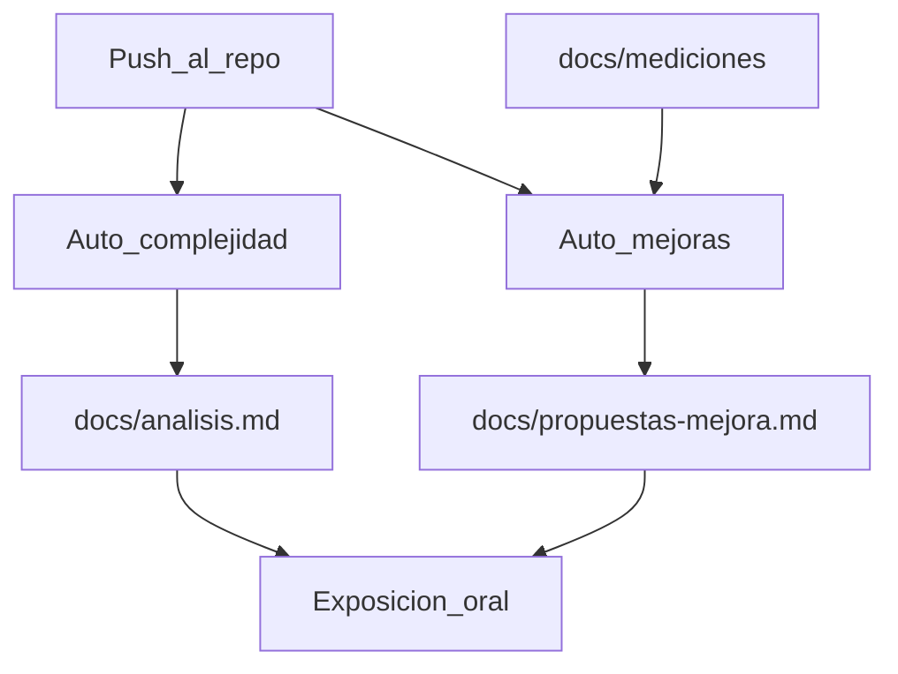

# Automatizaciones Origin (Etapa 6)

Dos agentes en la nube de **Cursor Origin**, disparados por Git. No son workflows de GitHub Actions. El núcleo reproducible vive en `automations/` y se puede correr en local; el dashboard de Cursor es el que programa el trigger. Toda la salida de los agentes se escribe en **español**.

Guía oficial de producto: [Automations](https://cursor.com/docs/cloud-agent/automations) y [Origin integrations](https://cursor.com/docs/origin/integrations).

---

## Qué queda listo en el repo

| Pieza | Ruta | Rol |
|---|---|---|
| Núcleo 1 | `automations/analizar_complejidad.py` | Recorre el AST de las funciones fundamentales y regenera el bloque marcado en `docs/analisis.md` |
| Núcleo 2 | `automations/proponer_mejoras.py` | Lee `docs/mediciones/` y escribe `docs/propuestas-mejora.md` **sin tocar** `src/` |
| CLI | `python -m automations.ejecutar` | Lo invocan los agentes y también se usa en tests / push de prueba |
| Inventario | `automations/inventario_funciones.py` | Lista canónica de operaciones “fundamentales” |
| Skill 1 | `.cursor/skills/analisis-complejidad/SKILL.md` | Prompt versionado de la automatización 1 |
| Skill 2 | `.cursor/skills/hotspots-propuestas/SKILL.md` | Prompt versionado de la automatización 2 |
| Prompts listos | `docs/prompts-origin/` | Texto para pegar en [cursor.com/automations/new](https://cursor.com/automations/new) |

Cursor **no** lee un YAML de automations desde git: el trigger se configura en el dashboard. Las skills y este documento son la fuente versionada de las instrucciones.

---

## Corrida local (cierre de la etapa)

```bash
# Ambas automatizaciones
python -m automations.ejecutar

# Por separado
python -m automations.ejecutar --complejidad
python -m automations.ejecutar --propuestas

# Verificación
pytest tests/test_etapa_6.py -v
```

Un push que incluya cambios en el motor o en `docs/mediciones/` debe dejar `docs/analisis.md` y `docs/propuestas-mejora.md` actualizados (o un comentario equivalente en la PR).

---

## Cómo activarlas en Cursor (dashboard)

Las automations se crean en [cursor.com/automations/new](https://cursor.com/automations/new), en la Agents Window o con `/automate`. Hace falta una cuenta Pro / Teams / Enterprise y el repo Origin conectado.

Crear **dos** automations (un prompt cada una). Ajustes comunes:

| Campo | Valor recomendado |
|---|---|
| Repositorio | Este repo Origin (`gast-n-molina/PEF-Parcial-I-Optimizador-de-Inventario`) |
| Triggers | **Push to branch** → `main` (y `stage-6` mientras sea la rama de entrega). Más **Pull request opened** y **Pull request pushed** para cubrir feature branches |
| Tools | Dejar **Pull request creation**. Activar **Comment on pull request** |
| Model | El que use el equipo para Cloud Agents |
| Permissions | Private (trabajo del grupo) o Team Owned si debe firmar `cursor` |

**Anti-bucle:** el agente trabaja en una rama nueva `cursor/…` y abre PR. Nunca debe pushear sobre la rama que disparó el evento.

Pegar el contenido de:

- [prompts-origin/complejidad-temporal.txt](prompts-origin/complejidad-temporal.txt)
- [prompts-origin/hotspots-propuestas.txt](prompts-origin/hotspots-propuestas.txt)

Activar ambas y hacer un push de prueba (por ejemplo un cambio menor de comentario en el motor). Debe aparecer un agente que regenere docs o un comentario en la PR.

---

## Relación con la rúbrica



Estas automatizaciones **no sustituyen** la suite de medición ni la tabla tiempo/memoria: el agente razona; las mediciones empíricas siguen siendo del grupo.
