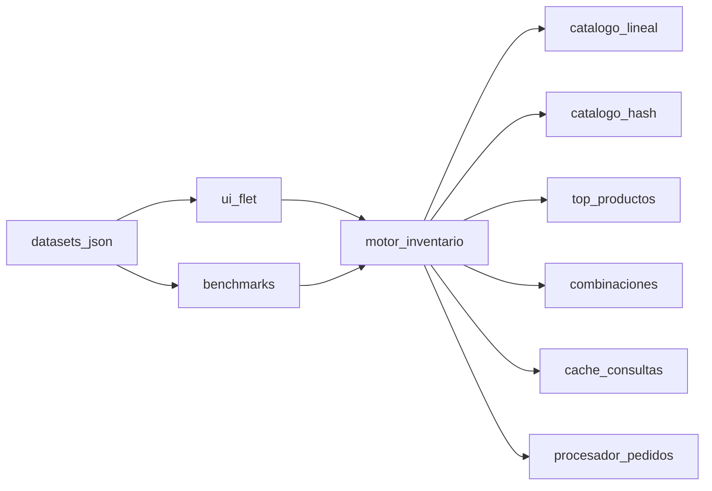
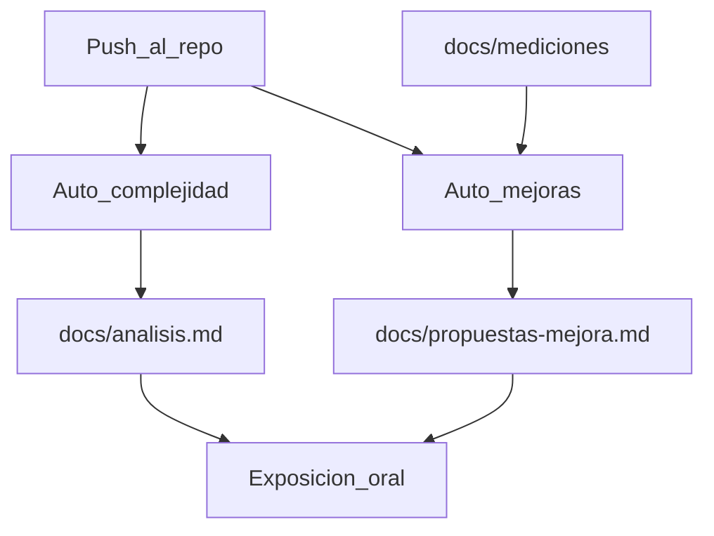

# Planificación del proyecto

Optimizador de inventario y pedidos (Python). Primer Parcial – Programación Eficiente, Opción 6.

Documento canónico de planificación. Describe alcance, arquitectura, rúbrica, UI Flet, datasets, medición y automatizaciones Origin.

**Resumen:** documentar el alcance en `README.md` (español), implementar el optimizador en Python con UI Flet, datasets de prueba cargables y motor baseline vs optimizado (memoización/caché, concurrencia), medido con cProfile, line_profiler, memory_profiler, Scalene y py-spy. En cada push, dos automatizaciones Origin actualizan complejidad y propuestas.

La implementación se hace **por etapas**. No se arranca la siguiente hasta cumplir el criterio de cierre de la actual. El detalle de diseño (rúbrica, Flet, datasets, medición, Origin) está más abajo; las etapas dicen *qué se construye y en qué orden*.

---

## Etapas de implementación

| Etapa | Nombre | Qué queda listo |
|---|---|---|
| 1 | Alcance | `README.md` describe el proyecto |
| 2 | Baseline y datos | Motor ingenuo + datasets cargables |
| 3 | Motor optimizado | Hash, top-N, combinaciones, caché, concurrencia |
| 4 | Interfaz Flet | App de escritorio para demo y resultados |
| 5 | Medición y tests | Profilers, tabla comparativa, equivalencia |
| 6 | Automatizaciones Origin | Complejidad y propuestas en cada push |

Regla: código, comentarios y textos en **español**. Los profilers no se lanzan desde Flet.

### Etapa 1 — Alcance y documentación

**Objetivo.** Fijar el contrato del proyecto antes de escribir lógica.

**Incluye**

- Reescribir [README.md](../README.md) en español: materia, problema, rúbrica, stack Flet, datasets, suite de medición, estructura del repo, cómo ejecutar (aunque los comandos se completen después), oral, Origin.

**Fuera de esta etapa:** código del motor, UI, datasets JSON.

**Cierre:** el README refleja este documento y un compañero puede entender qué se va a construir y por qué.

### Etapa 2 — Baseline y datos

**Objetivo.** Primera implementación funcional medible (requisito 1 de la rúbrica) y escenarios para ejercitarla.

**Incluye**

- Modelos (`Producto`, `LineaPedido`, `Pedido`).
- Catálogo lineal: búsqueda O(n), preparación de pedidos uno a uno, top-N ordenando frecuencias.
- API del motor (misma firma que usarán UI y benchmarks).
- Cargador JSON + generador con semilla fija.
- Datasets: `demo_oral.json`, `pequeno.json`, `mediano.json`, `grande.json`.

**Fuera de esta etapa:** dict/heap/memo/caché/procesos, Flet, profilers.

**Cierre:** se carga `pequeno.json` por código y se buscan productos / preparan pedidos / listan top-N con el catálogo lineal. Resultados deterministas con la semilla.

### Etapa 3 — Motor optimizado

**Objetivo.** Convivir baseline y optimizado para el desafío experimental. Subetapas en orden; cada una mantiene la misma API.

**3.1 Catálogo hash.** `dict` por id + índice de nombres. Misma API que el lineal. Cierre: misma respuesta que el baseline en `pequeno` / `mediano`.

**3.2 Agrupación y top-N.** Picking consolidado; `heapq` vs sort completo. Cierre: agrupación correcta; top-N equivalente por los dos métodos.

**3.3 Combinaciones y memoización.** Alternativas por categoría/presupuesto, con y sin memo. Cierre: mismo resultado; memo no sirve datos de otro universo de productos.

**3.4 Caché con invalidación.** LRU de búsquedas y del ranking; invalidar al mutar stock o registrar pedidos. Cierre: hit en consulta repetida; miss tras invalidar.

**3.5 Concurrencia.** Secuencial vs `ProcessPoolExecutor` para pedidos independientes. Cierre: mismos resultados; documentado el caso en que el overhead no paga.

**Fuera de esta etapa:** UI Flet, scripts de profiler, automations.

**Cierre de la etapa 3:** el motor puede elegir estrategia (baseline/optimizado, secuencial/concurrente) sobre los mismos datasets.

### Etapa 4 — Interfaz Flet

**Objetivo.** Demo oral y uso: cargar dataset, ejecutar operaciones, ver resultados.

**Incluye**

- App Flet (tema accesible e informativo).
- Pantallas: inicio, catálogo, pedidos, agrupación, más solicitados, alternativas, comparación.
- Selector de dataset empaquetado o JSON externo; “Ejecutar escenario”.
- Panel visible: dataset, N, estrategia, tiempo/memoria de la última corrida, resultado de negocio.

**Fuera de esta etapa:** lanzar profilers desde la UI; automations.

**Cierre:** flujo completo en la app (cargar → cada operación → resultados coherentes entre pantallas). Verificación manual de la app Flet.

### Etapa 5 — Medición, análisis y tests

**Objetivo.** Tabla obligatoria, evidencia de cuellos de botella y corrección.

**Incluye**

- Scripts: `comparar.py`, `perilar_cprofile.py`, `perilar_lineas.py` (line_profiler), `perilar_memoria.py`; comandos documentados para Scalene y py-spy.
- Informes en `docs/mediciones/` sobre los **mismos** datasets.
- `docs/analisis.md`: complejidad derivada, justificaciones, tabla tiempo/memoria.
- Tests de equivalencia baseline vs optimizado (`pequeno`, `mediano`).

**Cierre:** la tabla de la rúbrica tiene números reales; los tests pasan; se puede responder dónde está el cuello, qué cambió, si escala y el trade-off.

### Etapa 6 — Automatizaciones Origin

**Objetivo.** En cada push, refrescar complejidad y propuestas. Requiere código ya en el remoto.

**Incluye**

- Automation 1: funciones fundamentales → complejidad temporal → sección en `docs/analisis.md`.
- Automation 2: hotspots (leer `docs/mediciones/` si existe) → `docs/propuestas-mejora.md`. No aplican cambios de código solas.

**Cierre:** un push de prueba deja el análisis/propuestas actualizados (o comentario en PR).

---

## Contexto de la materia

Primer parcial de **Programación Eficiente**. El criterio de evaluación no es solo que la app funcione: hay que **analizar complejidad**, **elegir algoritmo y estructuras**, **memoizar/cachear**, **concurrir con justificación**, **perfilar** y **medir antes/después**.

Lenguaje elegido: **Python**. Todo artefacto del repo (código, comentarios, nombres de módulos, README, scripts, docs de análisis) irá **exclusivamente en español**.

La implementación arranca por la **Etapa 1** (README de alcance). No se mezcla trabajo de etapas posteriores en el mismo lote.

---

## Qué irá en el README (paso 1, inmediato)

Documento de alcance en español, no un manual vacío. Secciones:

- Título y datos de la materia (Primer Parcial – Programación Eficiente, Opción 6)
- Problema: gestionar catálogo y optimizar la preparación de pedidos a escala
- Objetivo académico (técnicas a demostrar, no solo CRUD)
- Alcance funcional: búsqueda, agrupación, top-N, procesamiento masivo, alternativas/combinaciones
- Cómo cada funcionalidad cubre un requisito de la rúbrica (complejidad, estructuras, algoritmo, memo/caché, concurrencia, perfilado)
- Desafío experimental: lista O(n) vs diccionario O(1)
- Stack: Python 3, **UI en Flet** (Flutter embebido), motor desacoplado, suite de medición
- Datasets de prueba versionados para cargar en la UI y en los benchmarks
- Herramientas de eficiencia: `cProfile`, **line_profiler**, `memory_profiler` / `tracemalloc`, Scalene, py-spy, `timeit` / `perf_counter`, y benchmarks de escala
- Estructura prevista del repo
- Cómo ejecutar (app Flet + carga de dataset + scripts de profiler); los comandos se completarían al implementar
- Entregables de medición (tabla obligatoria + capturas/informes por herramienta) y nota de la exposición oral (10–15 min)
- Automatizaciones Origin: en cada push se refresca el análisis de complejidad y un informe de propuestas de mejora

---

## Modelo de dominio

Sistema de **almacén**: productos con stock y pedidos que hay que preparar.

- **Producto:** `id`, `nombre`, `categoria`, `stock`, `precio`
- **LineaPedido:** `id_producto`, `cantidad`
- **Pedido:** `id`, lista de líneas

Operaciones que dan pie a las técnicas de la materia:

| Funcionalidad | Operación crítica | Técnica a demostrar |
|---|---|---|
| Búsqueda por id / nombre | Recorrido vs índice | Lista vs `dict` (desafío O(n) vs O(1)) |
| Productos más solicitados | Top-N | `heapq` vs ordenar todo O(n log n) |
| Agrupación de pedidos | Fusionar líneas por producto (batch picking) | `dict` de agregación |
| Alternativas para completar | Combinaciones por categoría/presupuesto | Memoización (DP) |
| Consultas repetidas | Búsquedas y top-N | Caché LRU + invalidación |
| Muchos pedidos | Disponibilidad + alternativas por pedido | `ProcessPoolExecutor` (CPU-bound) |

---

## Arquitectura

Dos implementaciones **comparables** en el mismo repo: baseline (ingenuo, medible) y optimizado. La **UI Flet** y los **benchmarks** llaman al mismo motor; la estrategia (baseline/optimizado, secuencial/concurrente) se elige en la interfaz o por flag del script.

Estructura prevista:

- [README.md](../README.md) — alcance (español)
- [docs/project-planning.md](project-planning.md) — este documento de planificación
- `src/modelos/` — `Producto`, `Pedido`
- `src/inventario/catalogo_lineal.py` — baseline: lista, búsqueda O(n)
- `src/inventario/catalogo_hash.py` — `dict` por id + índice de nombres
- `src/pedidos/agrupador.py` — agrupar líneas de N pedidos
- `src/pedidos/combinaciones.py` — alternativas con y sin memoización
- `src/pedidos/procesador_secuencial.py` / `procesador_concurrente.py`
- `src/ranking/top_productos.py` — sort completo vs `heapq.nlargest`
- `src/cache/cache_consultas.py` — LRU + invalidación al mutar stock/catálogo
- `src/datos/cargador.py` — leer/validar JSON de datasets
- `src/ui/` — aplicación **Flet** (pantallas, tema, componentes)
- `data/datasets/` — datasets de prueba versionados (ver sección dedicada)
- `benchmarks/generar_datos.py` — regenera o amplía datasets sintéticos
- `benchmarks/comparar.py` — genera la tabla obligatoria (tiempo + memoria) con `perf_counter` / `tracemalloc`
- `benchmarks/perilar_cprofile.py` — perfil por función
- `benchmarks/perilar_lineas.py` — **line_profiler** sobre las operaciones críticas
- `benchmarks/perilar_memoria.py` — `memory_profiler` de catálogo hash vs lista y de la caché
- `docs/mediciones/` — salidas crudas (`.txt`/`.prof`) para la oral y para la automatización de hotspots
- `docs/analisis.md` — complejidad (rúbrica + salida de la automatización Origin), justificaciones, tabla de mediciones
- `docs/propuestas-mejora.md` — informe de la segunda automatización (hotspots y alternativas)
- `tests/` — pruebas de corrección (mismo resultado baseline vs optimizado)

---

## Cómo se cubre cada requisito de la rúbrica

**1. Baseline.** Primera versión funcional solo con listas y bucles: buscar producto recorriendo el catálogo; preparar pedidos uno a uno; top-N ordenando todas las frecuencias.

**2. Complejidad (mínimo 2 operaciones, con derivación).** Cubierto de dos formas: justificación escrita en `docs/analisis.md` y refresco automático en cada push (ver automatizaciones Origin).

- Búsqueda por id en lista: O(n) — en el peor caso se recorren todos los productos.
- Búsqueda por id en `dict`: O(1) promedio — hash del id.
- Top-N: ordenar O(n log n) vs heap O(n log k).
- Combinaciones sin memo: explosión exponencial; con DP/memo, se acota por estados.

**3. Elección de algoritmo.** Justificar heap para top-N (k << n) y DP memoizado para alternativas (evitar recomputar subproblemas). No “usar threads porque sí”.

**4. Estructuras (mínimo 2, mejor 4 con justificación).**

- Lista: baseline y orden de inserción.
- Diccionario: catálogo por id, agregación al agrupar pedidos.
- Heap (`heapq`): top-N más solicitados.
- Conjunto: categorías / ids únicos al validar un pedido.

**5. Memoización y caché (ambas, para diferenciarlas en la oral).**

- Memoización: `@lru_cache` / tabla DP en `combinaciones` (qué se guarda: subproblema (indice, restante); cuándo se reusa: mismo presupuesto/categoría; invalidación: limpiar caché si cambia el universo de alternativas).
- Caché: LRU de búsquedas por nombre y del ranking top-N; invalidar al alta/baja de stock o al registrar pedidos.

**6. Concurrencia.** Procesar pedidos **independientes** en paralelo con `concurrent.futures.ProcessPoolExecutor` (cálculo de disponibilidad + combinaciones es CPU-bound; el GIL haría inútil `threading` aquí). Justificar independencia, mecanismo, y riesgos (copia de datos entre procesos, overhead con N chico). Medir también el caso donde el overhead no paga.

**7. Perfilado y medición (varias herramientas, no una sola).** Ver sección siguiente. `benchmarks/comparar.py` rellena la tabla obligatoria:

- Implementación inicial
- Estructura optimizada (dict)
- Algoritmo optimizado (heap / DP)
- Concurrencia
- Versión final

Preguntas a responder en `docs/analisis.md`: cuello de botella, impacto, si escala al subir el volumen, trade-off (memoria extra del índice/caché). Cada pregunta se apoya en **al menos una herramienta distinta** cuando aporte (función vs línea vs memoria vs procesos).

---

## Suite de medición de velocidad y eficiencia

El enunciado lista explícitamente herramientas Python: `cProfile`, `line_profiler`, `memory_profiler`, Scalene y py-spy. El alcance del proyecto las usa **todas**, cada una para una pregunta distinta (evitar “corrimos un profiler y listo”).

| Herramienta | Qué mide | Para qué la usamos |
|---|---|---|
| `time.perf_counter` / `timeit` | Tiempo de pared de una operación aislada | Celdas de tiempo de la tabla obligatoria; comparar baseline vs optimizado en el mismo input |
| `cProfile` + `pstats` | Tiempo **por función** (llamadas, tiempo acumulado) | ¿Dónde está el cuello de botella a nivel de API? Alimenta la automatización de hotspots |
| **line_profiler** (`kernprof`, `@profile`) | Tiempo **por línea** dentro de una función | Demostrar *por qué* la búsqueda lineal duele (el `for` sobre n productos) vs el acceso al `dict`; mismo criterio en combinaciones y top-N |
| `tracemalloc` | Memoria atribuida por Python | Columna “Memoria” rápida y reproducible en CI/local sin dependencias extra |
| `memory_profiler` (`@profile` / `mprof`) | Curva de memoria línea a línea | Trade-off del índice hash, de la caché LRU y de copiar catálogo a procesos |
| **Scalene** | CPU + memoria, y Python vs nativo | Vista única para la oral; detectar si el costo es el algoritmo o el runtime |
| **py-spy** (`record` / `top`) | Sampling sin instrumentar el código | Perfilar el pool de procesos (concurrencia) sin distorsionar tanto como cProfile |

**Protocolo de medición (mismo para todas las versiones):**

- Datos sintéticos con tamaños crecientes (p. ej. 1k / 10k / 100k productos y lotes de pedidos) para responder si la mejora **se mantiene al escalar**.
- Misma semilla y mismos datasets entre baseline y optimizado.
- Varias repeticiones y reportar mediana (evitar un solo run ruidoso).
- Guardar informes en `docs/mediciones/` (español en encabezados/comentarios).
- `requirements-dev.txt` (o extra de desarrollo) con `line_profiler`, `memory_profiler`, `scalene` — py-spy se documenta como herramienta externa.

**Encaje con el resto:** `comparar.py` produce la tabla; line_profiler y cProfile explican *dónde*; memory_profiler/Scalene explican *a qué costo*; py-spy valida el escenario concurrente. La automatización Origin de hotspots debe leer estos artefactos si están en el commit, no solo el código fuente.

---

## Interfaz Flet

La demo y el uso del sistema son una app de escritorio **Flet** (UI Flutter controlada desde Python). El motor **no** vive en la UI: Flet solo carga datasets, dispara operaciones y muestra resultados. Los profilers siguen yendo por `benchmarks/` para no contaminar tiempos con el render.

**Estilo (libre, pero con criterios):**

- Visualmente atractivo: jerarquía clara, tipografía grande, paleta contrastada, cards y espaciado generoso; no un formulario gris.
- Accesible: contraste alto (texto/fondo), no transmitir estado solo con color (icono + texto: “completo / faltante / error”), etiquetas en todos los controles, tamaños de toque cómodos, textos en español claro.
- Informativa: cada pantalla debe dejar ver *qué dataset*, *N productos / N pedidos*, *estrategia* (baseline vs optimizado, secuencial vs concurrente), *tiempo y memoria de la última corrida*, y el *resultado de negocio* (pedidos cubiertos, faltantes, top-N, picking agrupado, alternativas).

**Pantallas / zonas:**

- **Inicio:** elegir dataset empaquetado o archivo JSON externo; resumen del escenario.
- **Catálogo:** búsqueda por id/nombre y listado; interruptor baseline vs hash para ver el mismo resultado con distinto costo.
- **Pedidos:** procesar el lote (secuencial/concurrente); tabla de cubiertos / parciales / imposibles.
- **Agrupación:** lista de picking consolidada (producto → cantidad total → pedidos origen).
- **Más solicitados:** top-N con el método elegido (sort vs heap).
- **Alternativas:** si falta stock, combinaciones propuestas (con/sin memo, visible en el panel).
- **Comparación:** última corrida baseline vs optimizado (tiempo, memoria, mismo dataset) — material para la oral.

Textos, comentarios y nombres de controles en **español**. Al implementar, verificar la app Flet de punta a punta (cargar dataset → cada operación → resultados coherentes entre pantallas).

---

## Datasets de prueba

Necesarios para la UI, los tests, los benchmarks y la oral: un archivo = un escenario completo (productos + pedidos), misma semilla entre versiones.

Formato JSON (un cargador valida ids, stock ≥ 0, líneas que referencian productos existentes). Ruta: `data/datasets/`.

| Dataset | Uso | Escala orientativa |
|---|---|---|
| `demo_oral.json` | Exposición en vivo (nombres legibles, algún faltante de stock para mostrar alternativas) | ~30 productos, ~8 pedidos |
| `pequeno.json` | Prueba rápida en la UI y tests | ~100 productos, ~20 pedidos |
| `mediano.json` | Diferencia ya visible baseline vs hash | ~1 000 productos, ~200 pedidos |
| `grande.json` | Escalabilidad en UI (avisar si tarda) y benchmarks | ~10 000 productos, ~2 000 pedidos |
| `masivo.json` (generado, no obligatorio en git si pesa) | Solo benchmarks 100k; la UI puede advertir o no listarlo | ~100 000 productos |

`benchmarks/generar_datos.py` regenera los sintéticos con semilla fija. `demo_oral` se cura a mano para que la historia de la oral se entienda (categorías, un pedido imposible, varios que sí se agrupan).

La UI lista los datasets empaquetados y permite “Ejecutar escenario”: corre búsqueda / preparación / agrupación / top-N / alternativas según corresponda y pinta resultados + métricas de esa corrida. Los scripts de profiler usan **los mismos archivos**.

---

## Cómo se implementa (etapas)

El orden operativo está en **Etapas de implementación** (arriba). Resumen: 1 alcance → 2 baseline y datos → 3 motor optimizado (3.1–3.5) → 4 Flet → 5 medición y tests → 6 Origin.

No adelantar UI ni profilers antes de que el motor de esa etapa exista. Los profilers **no** se lanzan desde Flet.

---

## Automatizaciones Cursor Origin (en cada push)

Dos automatizaciones de **Cursor Origin** (agentes en la nube disparados por Git), no workflows de GitHub Actions. Objetivo académico: que el requisito de **análisis de complejidad** y el de **elección de algoritmo** se mantengan vivos a medida que crece el código.

Se configuran **después** del primer push con código real: las instrucciones del agente solo pueden citar rutas que ya estén commiteadas en el repo que dispara el trigger.

Disparador común: **nuevo push a la rama** del repositorio del proyecto (rama por defecto; si más adelante hay PRs, el mismo criterio aplica al push de la PR). Idioma de toda salida: **español**.

### 1. Análisis de complejidad temporal

Acompaña el punto 2 de la rúbrica (no lo reemplaza: el grupo sigue debiendo explicar de dónde sale la notación).

- **Qué hace:** recorre el código pusheado, identifica las funciones/algoritmos **fundamentales** del inventario (búsqueda, agrupación, top-N, combinaciones, procesamiento de pedidos, caché/memo) y deriva complejidad temporal (mejor/promedio/peor cuando aplique), con la justificación de cómo se obtiene y por qué importa al escalar productos/pedidos.
- **Qué no hace:** no reescribe lógica de negocio; no inventa Big-O sin recorrer el cuerpo de la función.
- **Salida:** actualiza o regenera la sección de complejidad en `docs/analisis.md` (marcar claramente el bloque generado por el agente vs el comentario del grupo). Si el trigger es una PR, comentario breve en la PR con el resumen.
- **Criterio de “fundamental”:** operaciones del enunciado y del motor/benchmarks; ignorar wrappers de Flet, handlers de UI y tests salvo que contengan el algoritmo.

### 2. Hotspots y propuestas de mejora

Acompaña el punto 3 (elección de algoritmo), el perfilado y las conclusiones de la oral (“qué harían diferente”).

- **Qué hace:** identifica las funciones que **más consumen**. Priorizar artefactos en `docs/mediciones/` si existen en el commit: `cProfile`, **line_profiler**, Scalene, py-spy y `memory_profiler`. Si no hay informes, análisis estático de bucles anidados, búsquedas lineales, recomputación, GIL y copias entre procesos. Propone algoritmos o estructuras alternativas y mejoras generales, con trade-off (tiempo vs memoria vs claridad) y si la propuesta ya está cubierta por baseline vs optimizado.
- **Qué no hace:** no aplica los cambios sola; solo propone, para que el grupo decida y pueda medir el impacto.
- **Salida:** `docs/propuestas-mejora.md` (informe versionado por push/commit) y, en PR, comentario con el top de hotspots.

### Relación con el resto del plan

Estas automatizaciones **no sustituyen** la suite de medición ni la tabla obligatoria tiempo/memoria: el agente razona; las mediciones empíricas (line_profiler, cProfile, memoria, Scalene, py-spy) siguen siendo del grupo.

Al ejecutar este bloque del plan se usará el flujo de creación de automations de Cursor (editor de Origin) con el disparador de push, herramientas de lectura del repo y, si hay PR, comentario en la PR. El alcance git (repo y rama) se confirma en el editor.

---

## Decisiones ya fijadas

- Python, repo en español, opción 6.
- UI de escritorio en **Flet** (accesible e informativa); motor y benchmarks desacoplados de la UI.
- Datasets JSON versionados (`demo_oral`, `pequeno`, `mediano`, `grande`) compartidos por UI, tests y profilers.
- Baseline y optimizado conviviendo para medir, no reescribir y borrar la versión lenta.
- Cubrir **todas** las funcionalidades “posibles” del enunciado porque cada una engancha un requisito de la rúbrica.
- Dos automatizaciones Origin en cada push: complejidad temporal de funciones fundamentales, y propuestas sobre las más costosas. No aplican cambios de código solas.
- Medición con varias herramientas del enunciado: `cProfile`, line_profiler, `memory_profiler`/`tracemalloc`, Scalene y py-spy, más `timeit`/`perf_counter` para la tabla.
